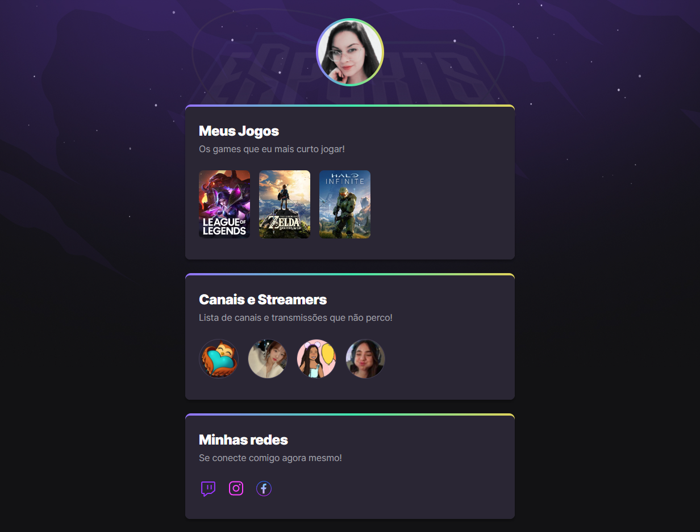

# NLW eSports

> Trilha Explorer

Projeto construído do evento Next Level Week da Rocketseat

[🔗 Clique aqui para acessar](https://tatigsilva.github.io/NLW/)
## 🛠 Tecnologias

- HTML
- CSS 
- Git e Github

## 📚 Com esse projeto aprendi:
- como funciona o programa figma
- buscar fontes e adicionar no código
- exportar imagens do figma
- como fazer uma transição no css
- como fazer uma animação no css 
- adicionar imagem em um link
- como fazer um gradiente no css

## 🗣 Contato 

 ✉ tatianegsilva95@gmail.com

